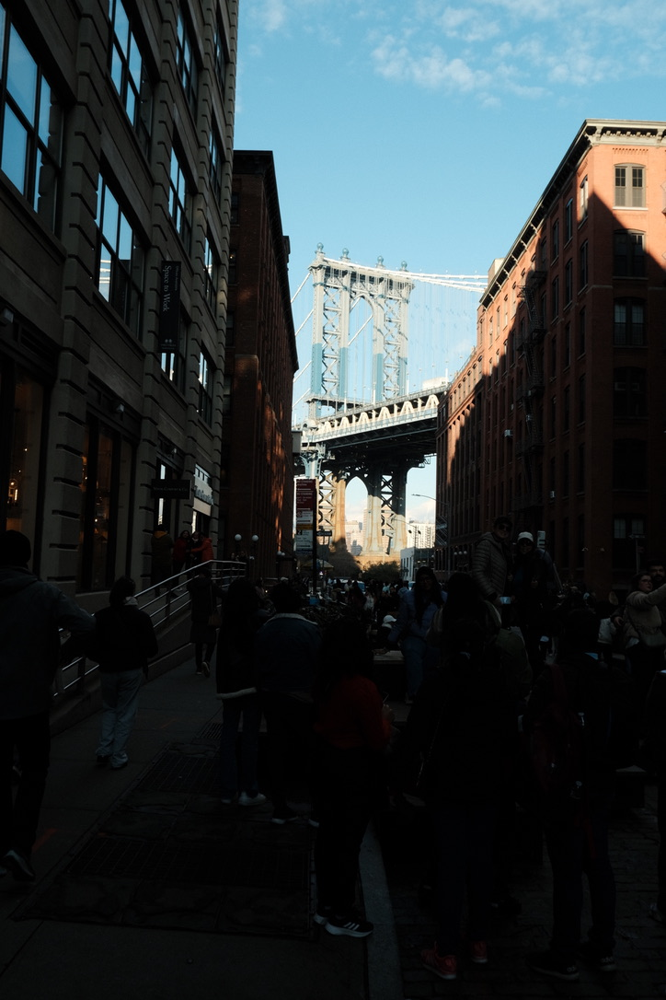

# photo_portafolio

A captivating photo portfolio website built with HTML and CSS, showcasing my passion for photography and web development.

## Features

- **Responsive Design:** The website is optimized for various screen sizes and devices, providing a seamless viewing experience.
- **Gallery Layout:** A visually appealing grid layout to display your photographs.
- **Lightbox Integration:** Click on any photo to view it in a lightbox with additional details.
- **Smooth Transitions:** Subtle animations and transitions enhance the overall user experience.
- **Cross-Browser Compatibility:** The website is compatible with modern web browsers, ensuring consistent rendering across platforms.

## Technologies Used

- HTML5
- CSS3

## Installation

1. Clone the repository: `git clone https://github.com/your-username/photo-portfolio.git`
2. Navigate to the project directory: `cd photo-portfolio`
3. Open the `index.html` file in your preferred web browser.

## Usage

1. Customize the website by replacing the placeholder images with your own photographs in the `images` directory.
2. Update the photo details (title, description, etc.) in the corresponding HTML  files.
3. Modify the CSS styles to match your desired color scheme and branding.

## License

This project is licensed under the [MIT License](LICENSE).

## Contact

For any inquiries or collaboration opportunities, feel free to reach out to me at [spg1824@gmail.com].
